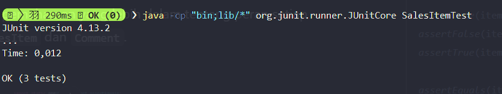

# **Tugss Week 10 PBO**

**Nama** : Adyuta Prajahita Murdianto

**NRP** : 5025221186

**Kelas** : PBO A

## **Class SalesItem**

```java
import java.util.ArrayList;
import java.util.List;

public class SalesItem {
  private String itemName;
  private double price;
  private List<Comment> comments;

  public SalesItem(String itemName, double price) {
    this.itemName = itemName;
    this.price = price;
    this.comments = new ArrayList<>();
  }

  public void addComment(String author, String text, int rating) {
    if (rating < 1 || rating > 5) {
      throw new IllegalArgumentException("Rating harus antara 1 dan 5.");
    }
    comments.add(new Comment(author, text, rating));
  }

  public int getNumberOfComments() {
    return comments.size();
  }

  public List<Comment> getComments() {
    return new ArrayList<>(comments);
  }

  public String getItemName() {
    return itemName;
  }

  public double getPrice() {
    return price;
  }
}
```

### **Attribute**

**itemName**

Menyimpan nama dari item yang dijual, misalnya "Tablet" atau "Headphones".

**price**

Menyimpan harga item dalam format `double`.

**comments**

Sebuah `List` yang menyimpan objek `Comment` terkait dengan item tersebut.

### **Method**

**SalesItem**

Menginisialisasi `itemName`, `price`, dan membuat daftar `comments` kosong.

**addComment**

Menambahkan komentar baru dengan validasi rating.

**getNumberOfComments**

Mengembalikan jumlah komentar yang ada.

**getComments**

Mengembalikan salinan daftar komentar untuk menjaga keamanan data.

**getItemName**

Getter untuk mengakses nama item.

**getPrice**

Getter untuk mengakses harga item.

## **Class Comment**

```java
public class Comment {
  private String author;
  private String text;
  private int rating;

  public Comment(String author, String text, int rating) {
    this.author = author;
    this.text = text;
    this.rating = rating;
  }

  public String getAuthor() {
    return author;
  }

  public String getText() {
    return text;
  }

  public int getRating() {
    return rating;
  }
}
```

### **Attribute**

**author**

Nama penulis yang memberikan komentar, seperti "David Smith".

**text**

Isi dari komentar, misalnya "Amazing quality!".

**rating**

Nilai penilaian dalam skala 1 hingga 5.

### **Method**

**Comment**

Menginisialisasi `author`, `text`, dan `rating` untuk membuat objek `Comment`.

**getAuthor**

Mengembalikan nama penulis komentar.

**getText**

Mengembalikan isi teks komentar.

**getRating**

Mengembalikan nilai rating dari komentar.

## **Class SalesItemTest**

```java
import org.junit.Test;
import static org.junit.Assert.*;
import java.util.List;

public class SalesItemTest {

  @Test
  public void testAddComment() {
    SalesItem item = new SalesItem("Tablet", 300.0);
    item.addComment("David Smith", "Amazing quality!", 5);
    assertEquals(1, item.getNumberOfComments());
  }

  @Test
  public void testAddInvalidComment() {
    SalesItem item = new SalesItem("Tablet", 300.0);
    assertThrows(IllegalArgumentException.class, () -> item.addComment("Emily Brown", "Poor design", 0));
  }

  @Test
  public void testGetComments() {
    SalesItem item = new SalesItem("Headphones", 120.0);
    item.addComment("Sarah Johnson", "Comfortable and great sound", 4);
    item.addComment("Michael Lee", "Average experience", 3);

    List<Comment> comments = item.getComments();

    assertEquals(2, comments.size());
    assertEquals("Sarah Johnson", comments.get(0).getAuthor());
    assertEquals("Comfortable and great sound", comments.get(0).getText());
  }
}
```

### **Method**

**testAddComment**

Method untuk melakukan test menambah komentar.

**testAddInvalidComment**

Method untuk melakukan test menambah komentar dengan format yang salah.

**testGetComments**

Method untuk melakukan test untuk mendapatkan komentar dengan method `getComments`.

## **Hasil Test**


